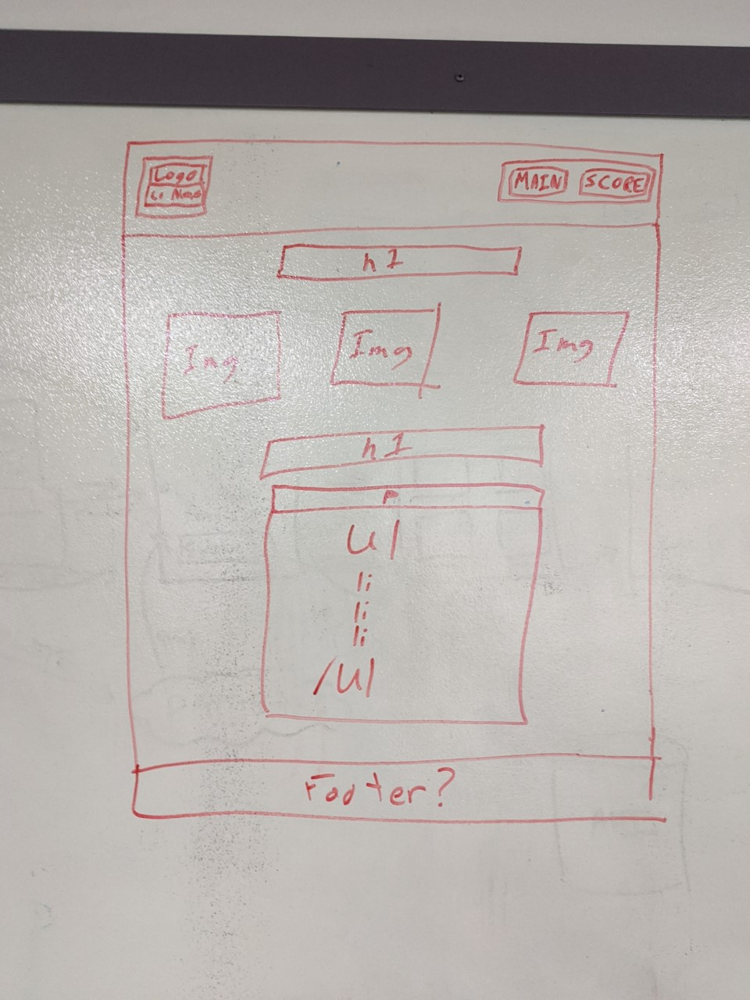

# (mem || y)

Code Fellows 201 - Final Group Project

## Group Members

The group members for this project consisted of:

- [Robert James Nielsen](https://github.com/robertjnielsen)
- [Eugene Monnier](https://github.com/eugenemonnier)
- [Andrew Kyllo](https://github.com/kyllo34)

## What Is (mem || y) ??

(mem || y) {memory} is a Simon-esque game where the user is presented with a sequence of colors that are displayed. They must then attempt to repeat the sequence correctly.

If successful, the sequence repeats, and continuously builds upon itself at random. This increases the length of the sequence, and the more the user must correctly remember in order to continue to advance in the game.

Once a user has failed to correctly repeat the sequence, they will be taken to a page that displays their results, as well as the "High Scores" of all users who have attempted the game before them.

## User Stories

Website Header
As a user, I want to be able to know what website I am on and navigate to the different parts of the website.

Feature Tasks
•	Create initial html pages with HTML boilerplate. (Main, High-Scores, About-Us)
•	Create page header (separate HTML & CSS files for each page) to be used on all pages. This will include:
o	Company Logo & Game Title
o	Navigation links for each page

Acceptance Tests
•	Able to load each page individually by opening the page in Chrome through terminal.
•	Header for each page looks like our defined wireframe.
•	Links for each page work in loading other pages in same tab.

Website Footer:
As a user, I would want to know when the page was created and check out the websites GitHub Repo.

Feature Tasks
•	Create footer for each page of the website.
•	Footer will have text describing the year the project was built.
•	Footer will contain a link to the website’s GitHub repo.
o	When clicked, the link will open a new tab in the browser.

Acceptance Tests
•	The footer text is visible at the bottom of the page.
•	When the link in the footer is clicked it will load the GitHub’s Repo in a separate tab.

## Wireframes & Mockups

Index / Game Page

Results / Score Page

About Us Page

Domain Modeling

