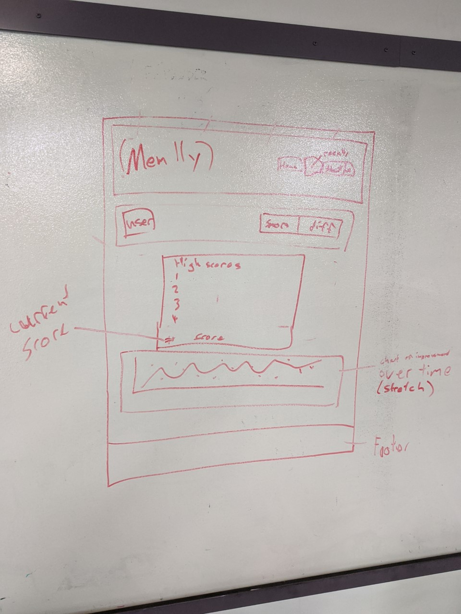

# (mem || y)

Code Fellows 201 - Final Group Project

## Group Members

The group members for this project consisted of:

- [Robert James Nielsen](https://github.com/robertjnielsen)
- [Eugene Monnier](https://github.com/eugenemonnier)
- [Andrew Kyllo](https://github.com/kyllo34)

## What Is (mem || y) ??

(mem || y) {memory} is a Simon-esque game where the user is presented with a sequence of colors that are displayed. They must then attempt to repeat the sequence correctly.

If successful, the sequence repeats, and continuously builds upon itself at random. This increases the length of the sequence, and the more the user must correctly remember in order to continue to advance in the game.

Once a user has failed to correctly repeat the sequence, they will be taken to a page that displays their results, as well as the "High Scores" of all users who have attempted the game before them.

## Wireframes & Mockups

Index / Game Page

Results / Score Page

About Us Page

